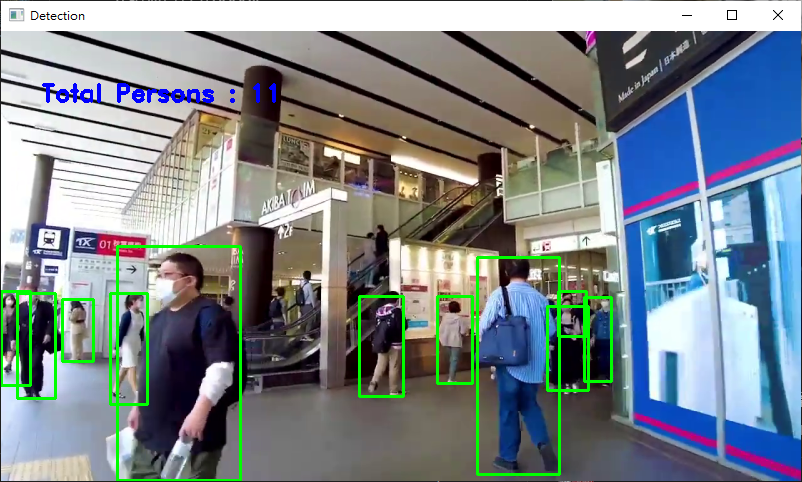
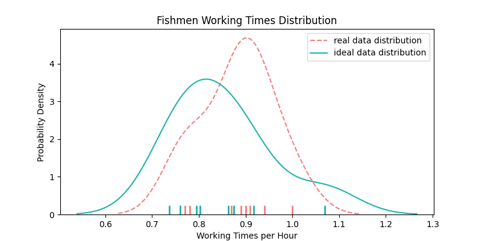

# Pedestrian Detection for Fishman Overwork Detection

此行人檢測系統為基於漁工過勞檢測系統所開發

**✍️ 誠摯的感謝我的夥伴** Annie 郭怡靚他幫我de了許多的bug

---

## Getting Started

很可惜這個程式並沒有隨附什麼一鍵完成的按鈕，要執行這個程式，只準備影片是不夠的，以下會帶大家一步步執行

---
* [事前準備](#事前準備)
* [環境建立](#環境建立)
* [程式執行](#程式執行)
* [執行結果](#執行結果)
* [輸出檔案](#輸出檔案) (ver1.1 新增)
* [KS-Test](#KS-Test)  (ver2.0 新增)
* [錯誤處理](#錯誤處理)
  

---
## 事前準備

這份說明是基於windows上寫的，因此，如果你用的是 linux 或 mac os，指令可能會不太一樣，但我相信應該會差不多!

首先，先將本程式的程式碼下載下來，你可以直接使用

```console
git clone https://github.com/AmazingWilson-hub/fishman_AI
```

來將整個程式碼下載，或著你也可以直接點選[這裡](https://codeload.github.com/AmazingWilson-hub/fishman_AI/zip/refs/heads/main)來下載

---
## 環境建立

本程式是利用python來撰寫，裡所當然你的電腦需要 python 的環境來執行，並且我們需要pip來安裝一些額外的  libraries ，我們可以利用以下簡單的兩個指令來檢查:

```console
py --version
```
>正常應該會顯示 Python 3.X.X


```console
pip --version
```
>正常應該會顯示 pip 21.X.X from ~ (python 3.X)

如果出來的結果顯示錯誤，那代表你的電腦沒有安裝python或遺失了 pip 套件(正常來說 pip 會連同你在安裝 python 時一起安裝)，那可能要請你自行去google。

接下來要安裝擴充的函示庫，建議在你下載的程式碼的根目錄資料夾執行:

```concole
py -m pip install --user opencv-python pafy youtube_dl imutils numpy scipy matplotlib ipython jupyter pandas sympy nose seaborn
```

---
## 程式執行

上述的步驟都完成之後，恭喜你，你可以開始執行本程式啦~

執行程式的指令基本上就是:

```console
python main.py argument path
```

根據來源的不同，可以選擇不同的指令來執行

- -v for video
- -i for image
- -s for youtube

舉例來說，如果你要輸入一個影片，你只需要:

Windows
```console
python main.py -v ‘Path_to_video’
```

Linux
```console
python3 main.py -v ‘Path_to_video’
```
PS : youtube連結不管是直播還是影片都能用喔，不過那個功能有點不穩定，如果出現錯誤多試幾次就可以了。<br>
     另外若出現`KeyError: 'dislike_count'`、`KeyError: 'like_count'`此錯誤，解決方式請詳見文件末端的[錯誤處理](#錯誤處理)的部分。


PSS : 如果你稍微去研究一下程式碼，會發現其實有一個 argument 是 -o，功能是輸出結果，但他目前是不能用的狀態，預計於下一個版本維修完成。

---

## 執行結果

大概會長的跟下圖差不多





---

## 輸出檔案

1.1版本新增了輸出檔案的功能，其內容包括了:

原文           | 功能  | 
------------  | ----  | 
Frames per second using | 原影片幀率 | 
Remaining frames    | 不到一小時的剩於幀數 | 
Remaining times  | 不到一小時的剩於時間 |
Remaining people appear frames  | 不到一小時的有人出現的幀 |
Remaining people appear times  | 不到一小時的有人出現的時間 |
Remaining weighted frames in one hour  | 不到一小時的有權重的幀 |
Remaining weighted times in one hour  | 不到一小時的有權重的時間 |
Remaining appears people  | 不到一小時的出現總人數 |
Remaining average people  | 不到一小時的平均出現人數 |
Total frames  | 在結束前的所有幀數 |
Total times  | 在結束前的所有時間 |
Total people appears frames  | 不到一小時的剩於時間 | 
Total people appears times | 在結束前的所有時間 |
Total weighted frames  | 在結束前的所有有權重的幀 |
Average people in this video | 每幀的平均人數 |

---

## KS-Test
2.0版本迎來重大更新，新增了程式可以處理輸出的檔案並輸出成圖表

首先先來介紹KS-Test，KS-Test是一種基於累計分布函數的非母數檢定，用以檢定兩個經驗分布是否不同或一個經驗分布與另一個理想分布是否不同。

KS-test是一種基於機率累積分布的測試，它用可以用來判斷理想分布和實際分布是否相似。

KS-test有以下幾個參數:


- 理想狀態的資料(包含產生理想資料的平均值、標準差)
- 實際狀態的資料
- alpha值 (最後算出來的p-value值如果大於該值，就代表兩者分布狀況相近==>沒有過勞，如果p-value值小於該值，就代表兩者分布不太相近==>過勞)

測試的程式本身設計得很簡單，你可以直接import從main輸出出來的output，也可以手動輸入資料，程式會告訴你當月是否有無過勞，如果是一日的話，則會輸出圖表及是否過勞，範例如下:

)


---
 ## 錯誤處理
 #### KeyError: 'dislike_count'、KeyError: 'like_count'
 由於youtube近期改版取消dislike顯示(部分影片會不顯示like數)，導致pafy函式庫在存取youtube影片會出問題，
 因此需要手動調整pafy對於youtube存取的程式碼內容<br>
 以下為`KeyError: 'dislike_count'`錯誤處理方式，若錯誤為`KeyError: 'like_count'`解決方式也相同
 
 
 若您執行時遇到下圖的狀況(以windows powershell執行圖為例):
 
 

 
 請您照以下步驟解決:
 
1. 使用任意編輯器(ex. 記事本、vim、vscode等等)開啟backend_youtube_dl.py檔案，以下以記事本為例

   * 先將上圖backend_youtube_dl.py檔案位置複製起來
     
   * 接著開啟記事本，點選左上角檔案，並點擊裡面的開啟選項，將剛複製的檔案位置貼在箭頭指的位置並開啟
   
   
2. 編輯backend_youtube_dl.py文件內容，在`self._dislikes = self._ydl_info['dislike_count']`此行(line 54，可用尋找功能)前面加上`#`註解
   ```python
   #self._dislikes = self._ydl_info['dislike_count']
   ```
3. 修改完成後重新測試即可順利執行，並不影響原程式功能
   


---

## Meet the Team 

郭弘偉
郭怡靚
許庭涵
陳怡靜
孫嘉成
沈芳儀
鄭雅云
黃浚佑


---

## Support

如果你有任何問題，歡迎聯絡我
amazingwilson@csie.io
我會盡一切可能幫助你

---

## Reference

https://data-flair.training/blogs/pedestrian-detection-python-opencv/

https://data-flair.training/blogs/python-project-real-time-human-detection-counting/


